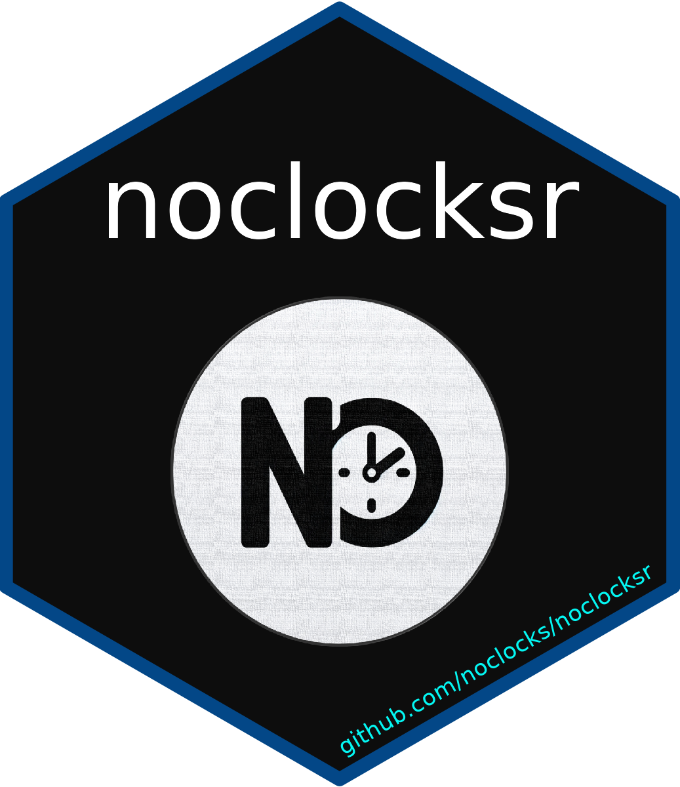

---
output: github_document
---

<h1 align="center">No Clocks R Package<code>noclocksr</code></h1>

<p align="center">
  <a href="CHANGELOG.md">Changelog</a>
    &middot;  
  <a href="https://docs.noclocks.dev/noclocksr/">Documentation</a>
    &middot;  
  <a href="https://docs.noclocks.dev/noclocksr/develop/">Development Documentation</a>
</p>

<p align="center">
  
</p>

<p align="center">
  
</p>

***

- [Badges](#badges)
- [Installation](#installation)
- [Examples](#examples)

> This is an R package built by [No Clocks, LLC](https://noclocks.dev)
> for internal R development purposes.

## Badges

<!-- badges: start -->

[](https://github.com/jimbrig/noclocksr/actions/workflows/roxygen.yml)
[](https://github.com/jimbrig/noclocksr/actions/workflows/lint.yml)
[](https://github.com/jimbrig/noclocksr/actions/workflows/pull-requests.yml)
[](https://github.com/jimbrig/noclocksr/actions/workflows/style.yml)
[](https://github.com/jimbrig/noclocksr/actions/workflows/coverage.yml)
[](https://github.com/jimbrig/noclocksr/actions/workflows/check.yml)
[](https://codecov.io/gh/jimbrig/noclocksr)
<!-- badges: end -->

## Installation

You can install the development version of `noclocksr` using your
preferred R package installation method:

``` r
# pak
pak::pak("noclocks/gmhleasr")

# remotes
remotes::install_github("noclocks/gmhleasr")

# devtools
devtools::install_github("noclocks/gmhleasr")
```

## Examples

``` examples
library(noclocksr)
noclocksr:awesomefunction()
```

------------------------------------------------------------------------

© [No Clocks, LLC](https://noclocks.dev) 2024
